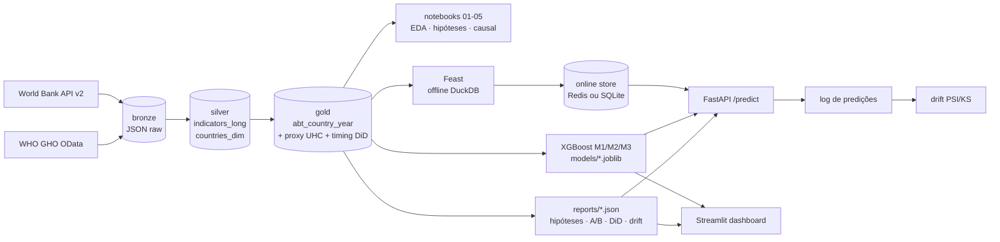

# global-health-analytics

Plataforma de analytics e inferência causal sobre um painel público de saúde global
(**World Bank + WHO GHO**): país × ano, 1990–2023, 217 países.

Pipeline reprodutível **medallion** (bronze → silver → gold), EDA e testes de hipótese,
3 modelos XGBoost, A/B simulado + DiD causal, e serving em produção
(Feast + FastAPI + Streamlit + CI/CD + monitoramento de drift). Pergunta central:
**expandir a cobertura de saúde (UHC) aumenta a expectativa de vida?**

> Roadmap e decisões: [PLAN.md](PLAN.md) · Convenções p/ agentes: [AGENTS.md](AGENTS.md)

## Principais resultados

| | Resultado |
|---|---|
| **Proxy UHC** | Índice 0–1 construído dos insumos (médicos, enfermeiros, leitos, gasto, saneamento, água, vacinas). Correlação com o SCI oficial da WHO: **Pearson 0.91** (n = 4 607 país-anos). |
| **H2** saneamento > 80% | Mortalidade <5 **43/1000 menor** (mediana; IC95 −49 a −36). Ajustado por PIB: −25/1000. ✅ |
| **H4** urbanização | −28/1000 por +1 DP, dentro do país (FE país+ano, controle PIB). ✅ |
| **H6** vacina sarampo | −10/1000 por +1 DP, dentro do país. ✅ |
| **H1** médicos → LE | Entre países: +1.8 ano/DP. **Dentro do país: −1.1** (sinal oposto, persiste sem Europa/Ásia Central). A associação clássica é de desenvolvimento, não efeito marginal. |
| **H3** gasto público → LE | Não significativo após Holm. |
| **H5 / DiD causal** | TWFE e DiD escalonado dão efeito **negativo** (−1.6 / −0.8 ano), mas o event study mostra tendência **pré-existente** (convergência dos mais pobres). Com ajuste de tendência: **+0.07 ano, IC95 [−0.53, 0.62]** — sem efeito detectável. Controle sintético (China, Vietnã) concorda (placebo p = 0.17 / 0.62). |
| **A/B simulado** | Randomizar +20% nos insumos entre ~190 países: efeito real (via M1) +1.2 ano vs MDE de 3.4 anos (1.6 com CUPED, que reduz ~80% da variância). **Subdimensionado** — poder empírico ~15% → ~60% com CUPED. |
| **Modelos** (teste 2020–23) | M1 LE: R² 0.85 (RMSE 2.95); M2 mortalidade <5: R² 0.77; M3 marco alto: AUC 0.99. XGBoost > baseline linear em todos. |
| **Drift** | Valor: só PIB (US$ correntes → inflação) e fertilidade. Performance: RMSE de 2022 > 1.5× validação (pós-COVID). Intervalo 90% do M1 cobre só 77% em 2020–23. |

Detalhes e gráficos nos notebooks [`01_eda`](notebooks/01_eda.ipynb) ·
[`02_visualization`](notebooks/02_visualization.ipynb) ·
[`03_hypothesis_testing`](notebooks/03_hypothesis_testing.ipynb) ·
[`04_modeling`](notebooks/04_modeling.ipynb) · [`05_ab_causal`](notebooks/05_ab_causal.ipynb).

## Arquitetura



## Stack

| Camada | Tecnologia |
|---|---|
| Ingestão | World Bank API v2 (paginada) + WHO GHO OData → JSON bruto |
| Warehouse | DuckDB (views sobre Parquet, `src/utils/db.py`) |
| Medallion | `data/bronze` → `data/silver` → `data/gold` (ABT wide) |
| Análise | pandas, statsmodels, linearmodels (PanelOLS), scipy |
| Modelos | scikit-learn (baseline) + **XGBoost** + SHAP |
| Causal | DiD escalonado por coorte (estilo Callaway–Sant'Anna), controle sintético de-meaned |
| Feature store | Feast 0.66 — offline DuckDB, online Redis (ou SQLite) |
| API | FastAPI + pydantic |
| Dashboard | Streamlit + plotly |
| CI/CD + monitoramento | GitHub Actions, PSI/KS, RMSE por ano |

## Como rodar

Requer Python ≥ 3.11 (desenvolvido em 3.14). Docker só é necessário para o Redis.

```bash
make install            # .venv + requirements.txt
cp .env.example .env    # opcional; ONLINE_STORE_TYPE=sqlite dispensa Redis

make all                # ingest -> silver -> gold -> train -> abtest -> hypotheses -> drift
make notebooks          # (re)executa os notebooks 01-05
make test lint
```

A ingestão completa leva ~3–5 min (a API do World Bank é lenta e tem rate limit; é
idempotente — rode de novo e só o que falhou é rebaixado; veja `data/bronze/ingest_log.json`).

### Serving

```bash
make redis-up                                  # ou: export ONLINE_STORE_TYPE=sqlite
make feast-materialize                         # gold -> Feast offline -> online store
make serve                                     # API em http://localhost:8000/docs
make dashboard                                 # http://localhost:8501
```

```bash
# features mais recentes do país (online store) + 3 predições com intervalo 90%
curl -X POST localhost:8000/predict -H 'content-type: application/json' \
     -d '{"country_id": "BRA"}'

# cenário "e se": ano específico (ABT) + insumos alterados
curl -X POST localhost:8000/predict -H 'content-type: application/json' \
     -d '{"country_id": "NGA", "year": 2015, "overrides": {"sanitation_basic": 95}}'

curl localhost:8000/experiments        # hipóteses + A/B + DiD
```

Sem online store disponível a API cai automaticamente para a ABT gold
(`/health` mostra a fonte em uso).

## Decisões de projeto

- **Proxy UHC**: o SCI oficial só cobre 2000–2023. O proxy cobre 1990+, com
  interpolação intra-país dos insumos estruturais (só no cálculo do índice; colunas da
  ABT ficam cruas), log do gasto e média ponderada sobre os componentes disponíveis
  (≥ 50% do peso).
- **Timing do DiD**: primeiro ano ≥ 2000 em que o proxy cruza 0.5 de forma sustentada.
  Antes de 2000 a composição do índice muda (séries de gasto/saneamento começam em 2000) e
  geraria cruzamentos artificiais. Países que já começam acima são *always-treated* (fora);
  controles *never-treated* precisam ter o proxy observado em ≥ 50% dos anos.
- **Split temporal** (treino ≤ 2015, validação 2016–19 com early stopping, teste 2020–23) —
  nunca aleatório num painel.
- **M3 não usa `uhc_index` como feature** — o label é definido por ele.
- **Intervalo de predição**: conformal split (quantil 90% do |resíduo| na validação); a API
  devolve também a cobertura empírica medida no teste.
- **Drift**: PSI/KS só em valores observados; mudança de cobertura (missing) é sinal
  separado — senão séries que começam em 2000 pareceriam drift.

## Limitações

- Associações dos modelos não são causais; os efeitos causais estão só em H5/notebook 05.
- O "tratamento" do DiD é o cruzamento de um índice contínuo, não uma política discreta;
  os nunca-tratados são estruturalmente mais pobres. O resultado é *ausência de efeito
  detectável*, não prova de efeito nulo.
- PIB em US$ correntes deriva com a inflação → trocar por `NY.GDP.PCAP.KD` (preços constantes).
- Intervalo conformal absoluto: largo demais para países de baixa mortalidade.
- A online store guarda a linha mais recente por país; features esparsas daquele ano
  vêm vazias (consistente com o treino — o XGBoost lida com NaN).

## Estrutura

```
├── config/            indicators.yaml (catálogo WB + WHO), settings.py (.env)
├── src/
│   ├── ingestion/     worldbank.py, who_gho.py              -> bronze
│   ├── transform/     bronze_to_silver.py, build_abt.py, quality.py
│   ├── features/      uhc_index.py (proxy + timing DiD + validação vs SCI)
│   ├── modeling/      dataset.py (split temporal), train.py (M1/M2/M3)
│   ├── analysis/      eda.py, hypotheses.py (H1-H6)
│   ├── abtesting/     simulate_ab.py, causal_did.py
│   ├── serving/       feast_features.py, feast_cli.py, predictor.py, app.py (FastAPI)
│   ├── monitoring/    drift.py
│   ├── viz/           style.py (paleta validada p/ daltonismo)
│   └── utils/         db.py (DuckDB), io.py
├── notebooks/         build_notebooks.py -> 01..05.ipynb (executados)
├── dashboard/         app.py (Streamlit)
├── reports/           hypotheses.json, ab_simulation.json, causal_did.json, drift_report.json
├── tests/             ingestão, transform, modelos, análise, API, drift, dashboard
└── .github/workflows/ ci.yml (lint + testes + smoke), monitoring.yml (semanal)
```
